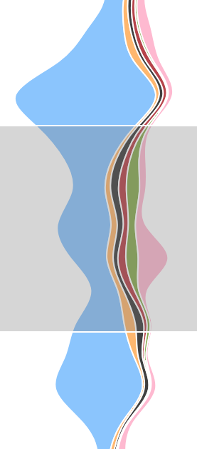

# Missing Migrants Visualization

## [Live Demo](https://dbeach24.github.io/missing-migrants-vis/)

[Click here](https://dbeach24.github.io/missing-migrants-vis/) for a live demo if the visualization.

## Overview

This project is a visualization of a dataset I originally discovered on [Kaggle](), called [Missing Migrants].  The dataset describes events where migrants have been discovered dead or missing, and aggregated from a combination of media, medical, and governmental reports from around the world.  The nature of this issue and the collection technique means that the information is incomplete, inconsistent, biased, and sometimes messy.  This project is attempt to clean this data and, hopefully, to shine a light on certain aspects of this problem in a way that communicates something of interest to the casual reader.

In particular, this project attempts to aid in answering the following questions:

* How does the number of missing / dead vary over time and by region?
* Are there certain locations that exhibit many small events which accumulate over time?
* What are the different causes of migrant death?
* How does cause of death vary by region?

## Using the visualization

### Stream Graph

The stream graph on the left hand size provides an overview of the missing migrant activity.  This graph is computed using the per-month totals of worldwide migrants deaths per cause.  This view is static, but brushing provides a linked brush-and-zoom interaction with the main bubble chart view.

### Bubble Chart

The bubble chart view shows individual migrant death/missing events.  Each event is marked by a circle where:

  * x-axis position = longitude of the event,
  * y-axis position = time of event,
  * area = number of migrants affected (dead + missing), and
  * color = indicates the dominant cause for this event.

You can use the mouse wheel to zoom in around a particular time, and use clicking and dragging to pan through time.  This will update the brushed selection region shown in the stream graph on the left.

From the bubble chart data, you can see that the events cluster into major vertical bands.  From left-to-right, these correspond to:

  * Americas
  * Eurpoe, Middle East, and Africa, and
  * Asia Pacific.

### Cause Legend

The cause legend uses custom icon markers and colors to indicate six major causal categories.  Each icon's color corresponds to the color used in the bubble chart.  Hovering over a category will perform a hilight-by-category interaction, for example:

In the above view, the "Drowning" cause has been selected.  This emphasizes the marks related to drowning in both the bubble chart and the stream graph, and deemphasizes all marks corresponding to other causes.  This should provide a "popout" effect for the selected data.

### Size Legend

The size legend is a static element which aids in interpreting the size of circles in the bubble chart.

### Details

Hovering over any circle in the bubble chart will cause a details popup to appear.  The details popup gives specific information, including:

  * event date,
  * number of dead and missing migrants,
  * all causal categories matched by this event (as icons),
  * the text location of the event,
  * a text description of the cause,
  * the nationalities of the migrants, when known,
  * the reporting source, and
  * whether the event is `Verified`, `Partially Verified`, or `Unverified`.

## About the Data

This dataset is from the [Missing Migrants](https://www.kaggle.com/jmataya/missingmigrants) data uploaded to Kaggle, and contains information about people who have gone missing while travelling along migration routes.  This data originates from the [Missing Migrants Project](https://missingmigrants.iom.int/).

The original data describe events where migrants have gone missing, and generally answer the following questions:

* Who – Number of people, Nationality, Region of Origin
* What – Dead or Missing
* Where – latitude, longitude, Incident Region
* When – Date
* How – Cause of Death

The data sets has 12 dimensions, and includes the following fields:

| Field            | Kind          | Notes |
| ---------------- | ------------- | ----- |
| ID               | Categorical   | Unique Event Identifier |
| Cause of Death   | Categorical   | Free-form text requires classification into categories to be useful |
| Region of Origin | Categorical   | Inconsistent encoding; needs cleaning |
| Nationality      | Categorical   | Origin nation names with mixed text; needs cleaning |
| Missing          | Quantitative  | Number of missing |
| Dead             | Quantitative  | Number of dead |
| Incident Region  | Categorical   | Mostly clean, but can also be computed from lat/lon |
| Date             | Quantitative  | European-style date in DD/MM/YYYY format |
| Source           | Categorical   | Fairly high cardinality (603), may be hard to reduce |
| Reliability      | Categorical   | Mostly clean: Verified, Partially Verified, Unverified |
| Latitude         | Quantitative  | Degrees latitude |
| Longitude        | Quantitative  | Degrees longitude |

## Enrichment and Feature Extraction

A script (included as a Jupyter/Python notebook is used to extract additional features from the data:

| Field            | Kind             | Notes |
| ---------------- | ---------------- | ----- |
| Region Num       | Categorical, Int | Region, encoded as a number, based on longitude. <ul><li>0 = Americas (longitude < -50)</li><li>1 = EMEA (-50 <= longitude < 75)</li><li>2 = Southeast Asia (longitude > 75)</li></ul> |
| Cause            | Categorical, Set | Text pattern extraction from “Cause of Death” field, into categories:<ul><li>Drowning/Asphyxiation</li><li>Exposure / Dehydration / Starvation</li><li>Vehicular / Mechanical</li><li>Homicide / Violence</li><li>Illness / Medical</li><li>Unknown</li></ul>
| Nationalities    | Categorical, Set | Extracted country names from “Nationality” text field.  Also needs to recognize region names (such as North Africa, Central America, or MENA, and handle appropriately). |

## Earlier work

An [earlier example of this work](http://blockbuilder.org/dbeach24/599725c960ce2881b1dcd46c3b20e268) can be found on [bl.ocks.org](https://bl.ocks.org).

## Attribution

This D3.js web project is based on [this template project](https://github.com/curran/dataviz-project-template) from [curran](https://github.com/curran).
